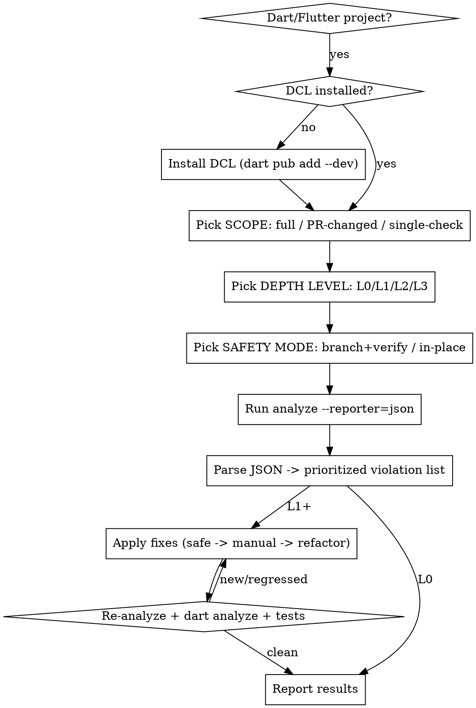

# Dart Code Linter (DCL)

## Overview

`dart_code_linter` (DCL) is a static analysis tool for Dart/Flutter — the maintained open-source fork of dart-code-metrics (DCM). It reports **rules**, **metrics** (cyclomatic complexity, nesting, parameter counts, etc.) and **anti-patterns**, and can apply some fixes automatically. This skill drives DCL end-to-end: install → analyze → parse the JSON output → fix violations → verify nothing broke.

**Core principle:** always analyze with `--reporter=json` so you can parse exactly *what* to fix and *where*, fix in batches from safest to riskiest, then **re-analyze and re-test after every batch** so a fix never silently breaks the build or tests.

**Canonical entrypoint:** `dart run dart_code_linter:metrics <command> <target>`. There is no top-level `dcl` binary.

## When to use

- "Lint / analyze my Dart (or Flutter) code", "find code smells", "check complexity / metrics".
- "Fix the lint problems automatically", "clean up this file/module".
- "Find unused files / unused code / unused localization".
- "Lint only what changed in this PR" / "validate PR #123".
- Setting up a CI quality gate for a Dart/Flutter repo.

**When NOT to use:** non-Dart projects; pure formatting (`dart format`) or core-SDK analyzer fixes (`dart fix`) with no DCL rules involved — though L1 still wraps those as a convenience.

## Operational loop (read this first)



### Step 0 — detect + install
1. Confirm a Dart/Flutter project: a `pubspec.yaml` exists. Flutter if it depends on `flutter`.
2. Confirm DCL is a dev dependency (grep `dart_code_linter` in `pubspec.yaml`). If absent, **ask before adding**, then: `dart pub add --dev dart_code_linter` (Flutter: `flutter pub add --dev dart_code_linter`). Run `dart pub get` / `flutter pub get`.
3. Confirm/create the config block in `analysis_options.yaml`. Plugin wiring differs by SDK (`plugins:` for Dart ≥ 3.9, `analyzer.plugins:` for < 3.9). See `references/setup.md`.

### Step 1 — pick scope, level, safety (ALWAYS ask the user these three unless already specified)
- **Scope:** full project (`lib`, optionally `test`), PR / changed files only, or a single check (unused files / unused code / unused l10n / unnecessary-nullable).
- **Depth level (L0–L3):** see table below and `references/levels.md`.
- **Safety mode:** `branch+verify` (clean tree → create branch → atomic commits → re-verify after each batch) or `in-place`. **Ask this at the start of every run that will modify code (L1+).** Default recommendation: `branch+verify`.
  - **Enforce the clean tree, don't just assume it:** before entering `branch+verify` (and before ANY destructive command), run `git status --porcelain`. If it is non-empty, stop and ask the user to commit/stash first (or explicitly confirm) — otherwise fix commits get mixed with pre-existing uncommitted work and a single-batch revert becomes impossible.

### Step 2 — run
Use the wrapper (it guarantees `pub get`, builds the command, writes JSON):
```bash
bash scripts/dcl-run.sh --target lib --json-out /tmp/dcl.json
```
Or directly:
```bash
dart run dart_code_linter:metrics analyze lib --reporter=json > /tmp/dcl.json
```
Full command/flag catalog: `references/cli-reference.md`.

### Step 3 — parse the output
DCL JSON groups violations per file. Get a prioritized, flat list with:
```bash
python3 scripts/parse-dcl-json.py /tmp/dcl.json
```
You need, per violation: `path`, `codeSpan.start.line/column`, `ruleId` (or `metricsId`), `severity`/`level`, `message`. Anti-pattern hits live in `antiPatternCases`; rule hits in `issues`; metric hits in each entity's `metrics[]` where `level != "none"`. Full schema + parsing recipe: `references/output-parsing.md`.

### Step 4 — fix (L1+)
Fix in this order, smallest blast radius first:
1. **Safe auto-fixes (L1+):** `dart fix --apply` (SDK rules) → `dart format .` → `dart run dart_code_linter:metrics fix <target>` (DCL fixes for 🛠 rules). These are mechanical.
2. **Manual rule fixes (L2+):** for non-fixable rule violations, apply the per-rule recipe in `references/fix-playbook.md` (e.g. `avoid-non-null-assertion`, `no-magic-number`).
3. **Structural refactors (L3):** for metric/anti-pattern violations (`long-method`, high `cyclomatic-complexity`, `maximum-nesting-level`, `long-parameter-list`) — extract methods, early-returns to flatten nesting, group params into objects. Recipes in `references/fix-playbook.md`.

Never apply a `suggestions[].replacement` blindly; confirm it matches the `codeSpan` and re-analyze after.

### Step 5 — verify (after EVERY fix batch)
```bash
bash scripts/dcl-verify.sh --target lib   # re-runs DCL analyze + dart analyze + dart/flutter test
```
A fix is only "done" when DCL reports the violation gone AND `dart analyze` is clean AND tests still pass. If a batch introduces a new violation or test failure, revert that batch and retry with a narrower fix. In `branch+verify` mode, commit each clean batch atomically (`dcl: fix <ruleId> in <files>`).

## Depth levels

| Level | Name | What it does | Edits code? |
|-------|------|--------------|-------------|
| **L0** | report-only | `analyze --reporter=json`, parse, present prioritized report. Diagnosis only. | No |
| **L1** | safe-fix | L0 + `dart fix --apply` + `dart format` + `dcl fix` (🛠 rules). Mechanical, low-risk. | Yes (safe) |
| **L2** | standard | L1 + enable anti-patterns + moderate metric thresholds + manual rule fixes via playbook, per file, re-verified. | Yes |
| **L3** | deep | L2 + aggressive thresholds + structural refactors (extract-method, flatten nesting, split params) + `--set-exit-on-violation-level=warning` CI gate. | Yes (structural) |

Per-level config templates: `scripts/config-templates/`. Full semantics: `references/levels.md`.

## PR / changed-files mode

Lint only the `.dart` files touched by a branch or PR:
```bash
# local branch vs base
bash scripts/dcl-changed-files.sh --base origin/main --json-out /tmp/dcl-pr.json
# a GitHub PR by number (uses gh CLI)
bash scripts/dcl-changed-files.sh --pr 123 --json-out /tmp/dcl-pr.json
```
It resolves changed `.dart` files (excluding deleted + generated `*.g.dart`/`*.freezed.dart`), runs `analyze` scoped to them, and you fix only those. Details + edge cases: `references/pr-mode.md`.

## CI gating

DCL exits non-zero on violations so CI can fail. Key flags: `--set-exit-on-violation-level=warning` (exit 2 on metric violations ≥ yellow), `--fatal-warnings` (on by default → exit 1 on rule warnings), `--reporter=github`/`gitlab` for inline annotations. Exit-code table + CI snippets: `references/ci.md`.

## Common mistakes & red flags

- **Running `analyze` with no target** → error. Always pass a dir/file (`analyze lib`).
- **Forgetting `dart pub get`** before `dart run` → command fails to resolve DCL.
- **Wrong plugin block for the SDK** → plugin silently not loaded, zero output. Match SDK version (`references/setup.md`).
- **`--fatal-warnings` is ON by default** → `analyze` can exit non-zero even without `--set-exit-on-violation-level`. Pass `--no-fatal-warnings` for metrics-only gating.
- **`check-unused-files --delete-files` is destructive** — never run it on a dirty tree or in an unattended fix flow. Verify `git status --porcelain` is empty first so deletions are reversible.
- **0-based line/column** in DCL JSON vs 1-based editors — reconcile before reporting locations to the user.
- **Applying fixes without re-verifying** — every batch must be followed by Step 5. No exceptions.
- **Confusing DCM commands** — `check-dependencies` does NOT exist in DCL. Real commands: `analyze`, `fix`, `check-unused-files`, `check-unused-code`, `check-unused-l10n`, `check-unnecessary-nullable`.

## Reference index

| File | Use for |
|------|---------|
| `references/setup.md` | Install, config skeleton, plugin wiring per SDK |
| `references/cli-reference.md` | All 6 commands + every flag (verbatim) |
| `references/rules-catalog.md` | All 84 rules grouped (Dart/Flutter/Flame/Intl), 🛠 = fixable |
| `references/metrics.md` | 10 metrics + thresholds + 2 anti-patterns |
| `references/output-parsing.md` | JSON schema + how to extract what/where to fix |
| `references/fix-playbook.md` | Per-rule and per-metric remediation recipes |
| `references/levels.md` | L0–L3 detailed behavior + config per level |
| `references/pr-mode.md` | Changed-files workflow (git diff + gh) |
| `references/ci.md` | Exit codes, severities, CI snippets |
| `references/troubleshooting.md` | Pitfalls, gotchas, monorepo/melos, performance |
| `scripts/dcl-run.sh` | Wrapper: pub get + analyze + JSON |
| `scripts/dcl-changed-files.sh` | Resolve + analyze changed `.dart` files |
| `scripts/parse-dcl-json.py` | JSON → prioritized violation list |
| `scripts/dcl-verify.sh` | Re-analyze + `dart analyze` + tests gate |
| `scripts/config-templates/` | `analysis_options.yaml` snippets per level |
